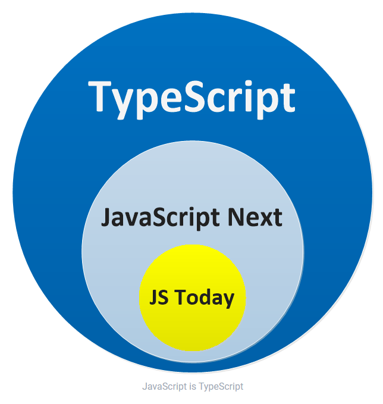

# TypeScript A to Z

### Why TypeScript?

<p align="center">
    
</p>

1. **Static typing**: TypeScript uses static typing to enforce type constraints on variables, functions, and other entities in the code. This allows developers to catch errors at compile time rather than at runtime, which can save time and reduce bugs.

2. **Object-oriented programming (OOP) support**: TypeScript supports OOP concepts like classes, interfaces, and inheritance, making it easier to write and maintain complex code.

3. **Enhanced IDE support**: Because TypeScript provides type information, IDEs can provide better code completion, error checking, and refactoring tools.

4. **Compatibility with JavaScript**: TypeScript is a superset of JavaScript, meaning that any valid JavaScript code is also valid TypeScript code. This makes it easy to migrate existing JavaScript projects to TypeScript.

5. **Modularity**: TypeScript supports modules, allowing developers to organize their code into reusable and maintainable components.

6. **Tooling and ecosystem**: TypeScript has a large and growing ecosystem of libraries and tools, making it easy to integrate with other technologies and build complex applications.

```typescript
[] + []; // JavaScript will give you "" (which makes little sense), TypeScript will error

//
// other things that are nonsensical in JavaScript
// - don't give a runtime error (making debugging hard)
// - but TypeScript will give a compile time error (making debugging unnecessary)
//
{
}
+[]; // JS : 0, TS Error
[] + {}; // JS : "[object Object]", TS Error
{
}
+{}; // JS : NaN or [object Object][object Object] depending upon browser, TS Error
"hello" - 1; // JS : NaN, TS Error

function add(a, b) {
	return;
	a + b; // JS : undefined, TS Error 'unreachable code detected'
}
```

<br/>

<br/>

### Install Typescript

```bash
npm i -g typescript

tsc --version
Version 4.9.3

ts-node hello.ts
```

<br/>

<br/>

### Source Code

```
.
├── 00_ESNext-core
│   └── 1_dstructuring-assignment.ts
│   └── 2_arrow-function.ts
```

### Reference

-   https://basarat.gitbook.io/typescript/
